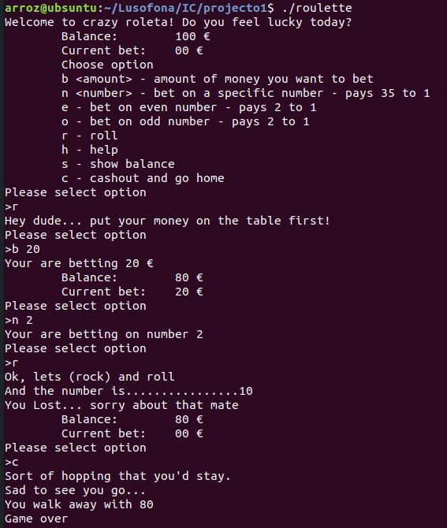

<!--
1º Projecto de Introdução à Computação 2018/2019 (c) by Pedro Serra

1º Projecto de Introdução à Computação 2018/2019 is licensed under a
Creative Commons Attribution-NonCommercial-ShareAlike 4.0 International License.

You should have received a copy of the license along with this
work. If not, see <http://creativecommons.org/licenses/by-nc-sa/4.0/>.
-->

# 1º Projecto de Introdução à Computação 2018/2019

## Descrição do problema

Pretende-se que os alunos, em **grupos de dois**, implementem um jogo da Roleta. O jogo deve começar por informar o utilizador que possui 100€ de créditos para apostar e mostrar a lista de comandos disponíveis.

O utilizador deverá fazer a sua aposta escolhendo a opção correspondente e indicando qual o valor que pretende apostar. Em seguida o utilizador deve selecionar uma das apostas possíveis:
* apostar nos números pares
* apostar nos números ímpares
* apostar num número específico

O número 0 é o número da casa e portanto o utilizador nunca ganha se sair zero.

Após a definição da aposta, o utilizador pode dar ordem para rolar. Deverá ser gerado um número aleatório entre 0 e 36 (inclusivé) e deverá ser verificado se o utilizador ganhou ou perdeu. No caso de vitória, o utilizador deverá ganhar segundo o rácio definido para a aposta que fez:
* Aposta par ou ímpar – 1 para 2
* Aposta num número específico – 1 para 35

O jogo acaba quando o utilizador ficar sem créditos ou quando selecionar a opção de sair. O utilizador não pode dar ordem para rolar sem ter concluído a sua aposta e não pode apostar
mais do que os créditos que possui.

## Exemplo de execução

### Opções Extra
* Implementação de três níveis de dificuldade escolhidas ao iniciar o programa que estabelecem a aposta mínima em:
    - 1€ - beginner,
    - 10€ - normal,
    - 20€ - expert.
* Implementação de um sistema que atrasa a operação de geração de números aleatórios para gerar alguma tensão. Deverá demorar cerca de 4 segundos até gerar o número e deve indicar o início e o progresso até o número estar gerado.
* Correcta utilização do Git, incluindo haver *commits* de ambos os alunos do grupo.

## Material a entregar

* Um Ficheiro zip contendo:
* Ficheiro `.c` com código devidamente comentado e indentado:
    - Deve implementar as funcionalidades pedidas.
    - Deve compilar sem erros e/ou avisos no compilador [GCC] e/ou [Clang] com as opções
      `-std=c99 -Wall -Wextra -Wpedantic`.
* Ficheiro `README.md` em formato [Markdown], contendo as seguintes secções:
    - Título
    - Nomes dos autores (primeiro e último) e respectivos números de aluno
    - Descrição da solução
    - Conclusões e matéria aprendida
    - Referências
        * Incluindo trocas de ideias com colegas, código aberto reutilizado e bibliotecas utilizadas
* A pasta escondida .git, no caso de terem utilizado o git.

## Forma de trabalho e data de entrega

A forma de obter, editar e submeter o trabalho será através do [Moodle] até às **23:59 de 13 de novembro de 2018**. Trabalhos entregues depois desta data sofrem de uma penalização de 0.2 valores por dia.

## Sobre o Git e GitHub

O [Git] é um sistema de gestão de código fonte, essencial para desenvolver qualquer tipo de Projectos. O [GitHub], e plataformas semelhantes tais como o [GitLab], [BitBucket] e [NotABug], oferecem repositórios Git remotos e vários serviços associados (_tracking_ de _bugs_, wikis, visualização de código, integração de ramos e por ai fora). Alguns tutoriais úteis e interessantes:

* [Aprender Git em 15 minutos][git-tutorial]
* [Learn Git](https://www.codecademy.com/learn/learn-git)
* [GitHub Hello World](https://guides.github.com/activities/hello-world/)
* [A Beginner’s Git and GitHub Tutorial](https://blog.udacity.com/2015/06/a-beginners-git-github-tutorial.html)

## Software necessário e/ou útil para elaboração do Projecto

* Compilador C99:
    - [GCC]
    - [Clang]
* Editor de C e Markdown:
    - [Gedit]
    - [Geany]
    - [Code::Blocks]
    - [Atom] (suporta pré-visualização de Markdown)
    - [XCode] (só macOS)
    - [Notepad++] (só Windows)
    - [Remarkable] (só Markdown, com pré-visualização)
    - [StackEdit] (editor online, só Markdown, com pré-visualização)
    - [(GitHub-Flavored) Markdown Editor]  (editor online, só Markdown, com pré-visualização)
    - ...
* [Git]
    - Linux: instalar a partir do *package manager*/centro de software
        * Ubuntu/Debian/Mint: instalar com comando `sudo apt install git`
    - macOS: incluido no XCode
    - Windows: [download](https://git-scm.com/download/win)

## Peso na avaliação

O projecto vale 10% da nota final (2 valores) e a avaliação do mesmo será feita da seguinte forma:

* 1,1 valores - Código (funcionalidade, indentação, comentários e compilação sem erros/warnings).
* 0,5 valores - Relatório em formato Markdown.
* 0,4 valores - Opções extra

## Honestidade académica

Nesta disciplina, espera-se que cada aluno siga os mais altos padrões de
honestidade académica. Isto significa que cada ideia que não seja do
aluno deve ser claramente indicada, com devida referência ao respectivo
autor. O não cumprimento desta regra constitui plágio [(3)](#ref3).

O plágio inclui a utilização de ideias, código ou conjuntos de soluções
de outros alunos ou indivíduos, ou quaisquer outras fontes para além
dos textos de apoio à disciplina, sem dar o respectivo crédito a essas
fontes. Os alunos são encorajados a discutir os problemas com outros
alunos e devem mencionar essa discussão quando submetem os Projectos.
Essa menção **não** influenciará a nota. Os alunos não deverão, no
entanto, copiar códigos, documentação e relatórios de outros alunos, ou dar os
seus próprios códigos, documentação e relatórios a outros em qualquer
circunstância. De facto, não devem sequer deixar códigos, documentação e
relatórios em computadores de uso partilhado.

Nesta disciplina, a desonestidade académica é considerada fraude, com
todas as consequências legais que daí advêm. Qualquer fraude terá como
consequência imediata a anulação dos Projectos de todos os alunos envolvidos
(incluindo os que possibilitaram a ocorrência). Qualquer suspeita de
desonestidade académica será relatada aos órgãos superiores da escola
para possível instauração de um processo disciplinar. Este poderá
resultar em reprovação à disciplina, reprovação de ano ou mesmo
suspensão temporária ou definitiva da ULHT [(2)](#ref2).

## Referências

* (1) Pereira, A. (2017). C e Algoritmos, 2ª edição. Sílabo.

* (2)  Texto adaptado da disciplina de [Algoritmos e Estruturas de Dados][aed] do [Instituto Superior Técnico][ist].

* (3)  Nuno Fachada. (2017). Primeiro Trabalho de Introdução à Computação, Licenciatura em Videojogos, Universidade Lusófona de Humanidades e Tecnologias, Lisboa.

## Licenças

Todo o código neste repositório é disponibilizado através da licença [GPLv3].
O enunciado e restante documentação são disponibilizados através da licença [CC BY-NC-SA 4.0].

## Metadados

* Autor: [Pedro Serra]
* Curso:  [Licenciatura em Aplicações Multimédia e Videojogos][lamv]
* Instituição: [Universidade Lusófona de Humanidades e Tecnologias][ULHT]

[GPLv3]:https://www.gnu.org/licenses/gpl-3.0.en.html
[CC BY-NC-SA 4.0]:https://creativecommons.org/licenses/by-nc-sa/4.0/
[lamv]:https://www.ulusofona.pt/licenciatura/aplicacoes-multimedia-e-videojogos
[Pedro Serra]:https://github.com/parroz
[ULHT ]:https://www.ulusofona.pt/
[aed]:https://fenix.tecnico.ulisboa.pt/disciplinas/AED-2/2009-2010/2-semestre/honestidade-academica
[ist]:https://tecnico.ulisboa.pt/pt/
 [Markdown]:https://guides.github.com/features/mastering-markdown/
 [GCC]:https://gcc.gnu.org/
 [Clang]:https://clang.llvm.org/
[Gedit]:https://wiki.gnome.org/Apps/Gedit
[Geany]:https://www.geany.org/
[Code::Blocks]:http://www.codeblocks.org/
[Atom]:https://atom.io/
[XCode]:https://developer.apple.com/xcode/
[Notepad++]:https://notepad-plus-plus.org/
[Remarkable]:https://remarkableapp.github.io/
[Git]:https://git-scm.com/
[repositório]:https://github.com/VideojogosLusofona/ic2017p1
[GitHub]:https://github.com/
[git-tutorial]:https://try.github.io/levels/1/challenges/1
[Moodle]:https://secure.grupolusofona.pt/ulht/moodle/
[GitLab]:https://gitlab.com/
[BitBucket]:https://bitbucket.org/
[NotABug]:https://notabug.org/
[StackEdit]:https://stackedit.io/editor
 [(GitHub-Flavored) Markdown Editor]:https://jbt.github.io/markdown-editor/
